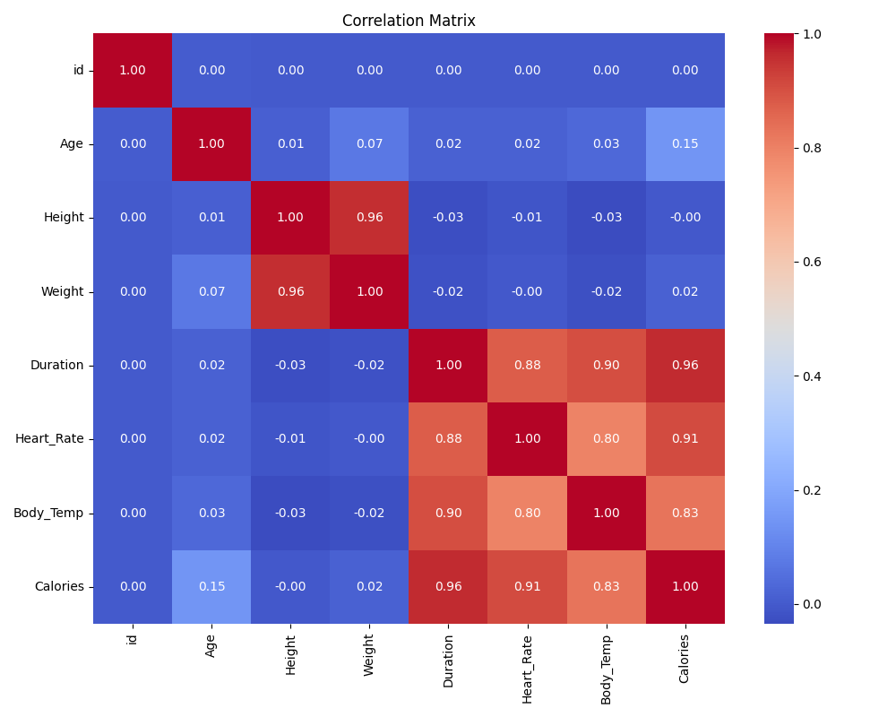
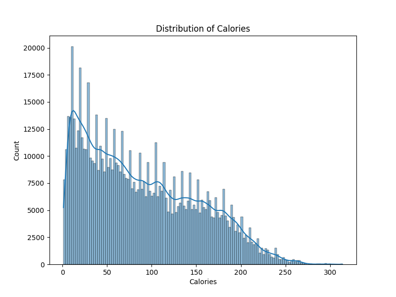
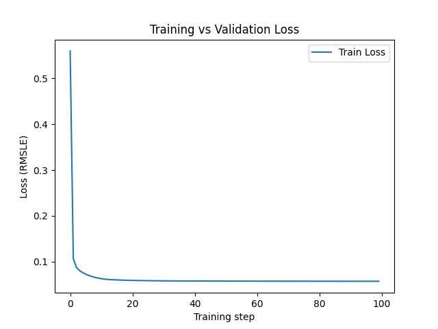
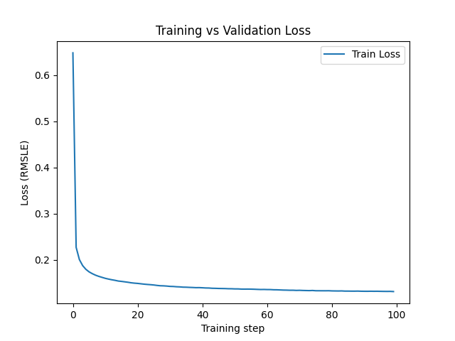

# Homework Report: Calorie Expenditure Prediction

## 1. Data Analysis (EDA)
We analyzed the dataset to understand the feature distributions and correlations.

**Key Findings:**
* **Correlation:** We observed a strong correlation between `Duration`, `Heart_Rate`, and `Body_Temp` with the target variable `Calories`. This suggests that workout intensity and duration are the most significant predictors.
* **Distribution:** The target variable `Calories` shows a right-skewed distribution.

---

## 2. Model Analysis & Experiments
To determine the optimal architecture, we conducted experiments comparing a baseline model against a model with regularization (Dropout rate = 0.2).

### Model A: Baseline (No Dropout)
* **Configuration:** Hidden Dim: 64, Dropout: 0.0
* **Result:** Final Validation RMSLE: **0.0576**

### Model B: Regularized (Dropout 0.2)
* **Configuration:** Hidden Dim: 64, Dropout: 0.2
* **Result:** Final Validation RMSLE: **0.0626**

### Conclusion
The experiment shows that the model **without Dropout** performed better. The model with Dropout exhibited a significantly higher Training Loss compared to its Validation Loss, suggesting **underfitting**. Given the dataset size and architecture, aggressive regularization was unnecessary.

**Selected Model:** No Dropout (RMSLE 0.0576).
